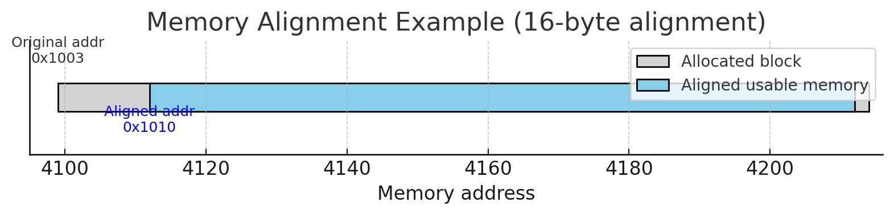

# Game Engine Architecture Book  
  
## 关于架构模式与设计模式  
### 	架构模式  
```
    	架构模式是用来解决系统及结构问题的设计理念, “如何组织各个模块? 模块之间如何通信? 如和初始化与销毁系统? 系统如何扩展、 可维护?” 等系统级思考.关注于模块、子系统、服务之间的关系, 它们的多数需要配合系统设计整体推进.
常见的一些架构模式: Layered(分层结构), Event-Driven(事件驱动型), MicroKernel/Plugin-Based(核心系统+插件式扩展), Component-Based(ECS架构,数据驱动组件系统), Client-Server(客户服务端架构), Service-Oriented/Microservices(服务化、解耦), Pipes and Filters Pattern(.

        

```
		  
  
### 	设计模式  
```
        设计模式是对常见程序实际问题的通用解决方法, 最早出现在四人帮,GoF的书里. 为代码级思考,解决对象和肋之间的协作问题, 关注于类、对象、函数等小范围结构. 它们的多数可直接在语言中实现.
典型的有三类:
           Creational(创建型, 如singleton(单例), Factory(工厂), Builder(建造者); 
           Structural(结构型, 如Decorator(装饰器), Adapter(适配器), Composite(组合)); 
           Behavioral(组合型, 如Observer(观察者), State(状态机), Strategy(策略));\
具体的设计模式类型网站在此

```
  
* **Singleton**  
	保证一个类在整个程序运行期间只有一个实例(整个进程中只有一个对象存在), 并提供全局访问点(通过getInsatance()(或静态变量)直接获取, 不用new多次).   
	**Key Design Point**:  
        1. 构造函数私有化: 防止外部随意new  
        2. 静态变量保存为一实例  
        3. 线程安全(在多线程场景)  
        4. 控制生命周期(尤其在引擎模块间有依赖时)		  
  
	常见的实现:  
		class RendererManager {  
		private:  
		    RendererManager() {}    
		public:  
		    static RendererManager& getInstance() {  
  		      static RendererManager instance; // C++11 线程安全  
 		       return instance;  
		    }  
		};  
```
管理器单一化(RendererManager, MemoryManager)其实就是很经典的Singleton的设计模式的体现

```
  
* **Factory**  
	将对象的创建过程封装起来, 让调用方不用关心具体创建细节, 只关心要创建的对象类型.  
  
* **Builder**  
	将复杂对象的创建过程分步骤进行, 允许使用同样的创建流程创建不同类型的对象.  
  
  
  
五大原则：单一职责（Single Responsibilities Principle）， 开闭原则（Open Close Principle）， 里氏替换（Liskov Substitution Principle）， 倒转依赖（ Dependence Inversion Principle）， 借口隔离（Interface Segregation Principle）   
一个法则：迪米特/知识最少法则（Least Knowledge Principle） 	  
——————>== **促成高内聚低耦合的代码**==  
  
****==架构模式关注系统结构，设计模式关注对象协作；架构是蓝图，设计是细节；两者结合，才能构建高效、可维护、灵活的系统。==****  
  
  
## ****甲.模块依赖与生命周期管理:****  
```
	这里设计方向基于System Architecture(系统架构), Initialization and Shutdown  Strategy(启动与关闭策略), Dependency Management(依赖管理) 和 Construction/Bootstrapping Patterns(构造模式)四个所属领域.

```
	  

| System Architecture（系统架构）                     | 定义各个子系统如何组合、通信和初始化 |
| --------------------------------------------- | ------------------ |
| Initialization and Shutdown Strategy（启动与关闭策略） | 控制子模块的生命周期顺序和依赖关系  |
| Dependency Management（依赖管理）                   | 明确模块间谁依赖谁，如何解除耦合   |
| Construction/Bootstrapping Patterns（构造模式）     | 系统从零开始构建时的模块加载策略   |
  
	有一些“more elegant”的例子:   
		“*You could have each manager register itself into a global priority queue and then walk this queue to start up all the managers in the proper order. *“ 全局优先队列的方式: 每个Manager 自习注册并带上自动优先级; 用一个中央调度器以此启动队列中Manager.  
		”*You could define the manager-to-manager dependency graph by having each manager explicitly list the other managers upon which it depends and then write some code to calculate the optimal start-up order given their interdependencies.*“ 依赖图的方式:  每一个Manager显式声明各自的Manager依赖.  
		”*You could use the construct-on-demand approach outlined above.*“ 按需构造的方式, 某个Manager在需要别的Manager时自动调用构造器初始化, 类似懒加载.  
  
依作者的经验, 一些“*brute force*“ 方法, 它还一直蛮奏效的:  
  
•**==很简约, 也易实现==**.  
  
•**==很直观, 各模块的启动顺讯能从代码中直接意会==**.  
  
•**==很方便地去排查问题和维护. 某个模块启动的不是时候, 直接可以代码调整的模块启动顺序==**.  
  
One minor disadvantage to the brute-force manual start-up and shut-down method is that you might accidentally shut things down in an order that isn’t strictly the reverse of the start-up order. But I wouldn’t lose any sleep over it. As long as you can start up and shut[…]”一个对于“*brute force*“的小缺点是: 手动调整后的启动顺序可能因疏忽导致不与关闭顺序严格逆反.  
  
```
这一章未完

```
	  
  
  
## ****乙.优化动态内存分配****  
```
动态内存分配(又称堆(heap)分配), 即通过malloc(), free()或是 new delete关键词进行的内存分配行为. 这通常很慢, 主要是两个原因: 
“高成本可以归因于两个主要因素。首先，堆分配器是一种通用设施，因此它必须被写入来处理任何分配大小，从一字节到一千兆字节。这需要大量的管理开销，使malloc（）和free（）函数本质上很慢。”
“Malloc() 或 free() 需要让操作系统进行从用户到内核的上下文转换“ 不过,没有引擎可以避免malloc()和free()的使用, 别太精神洁癖. 

```
  
### 	**Custom Allocator**  
	多数的游戏引擎多实现一个或多个自定义的内存分配器, 比操作系统自带的动态内存分配(malloc free操作)快很多, 原因有二:   
  
		•“先从操作系统要一整块，再在用户态自己管理，这样大多数分配就不用切换到内核态了，速度快很多”  
  
		•“系统的 malloc() 必须应对各种分配模式（大小不定、生命周期不定、释放顺序不定），所以设计很通用但性能没那么高。自定义 allocator 则可以大胆假设你的分配模式，然后裁剪掉很多通用功能，让性能和内存利用率更高“		  
  
### 	Stack-Based Allocator  
	游戏多通过Stack-like的形式分配内存, 通过“加载时分配, 运行时重用“的策略减少malloc调用.   
**		栈分配器的基本思想: **  
**			·**内存分配像压栈(push)  
			·内存释放像出栈(pop)  
			·遵循LITO后进先出策略  
  
	==由于Stack是连续分配空间且有序释放, 所以不会产生内存碎片问题==  
  
```
[ A ][ B ][ C ][ D ]
^base    ^top           
如果你想直接 free A（而 B 还在用），栈分配器没法把 B 往前搬，所以会浪费或者破坏 B 的数据。这就是**“必须按相反顺序释放”**的原因
作者提到的解决方法: 不提供free(单个块), 使用rollBack(marker)函数, 把栈顶一次性回滚到某个标记（marker）的位置, 回滚后 marker 之后分配的内存都算被一次性释放

```
### 	Double-Ended Stack Allocators  
	一个由两个栈组成的内存块, 平衡两端的栈的内存使用可让allocator更高效  
  
  
		在游戏引擎里, 这种常用在:   
			·零时几何缓冲区(如,Upper端只存储临时frame所需数据)  
			·粒子系统的短/长生命周期分离  
			·临时关卡数据 + 常驻物理数据并存  
  
### 	Pool Allocators  
	游戏里头最常见的一种自定义分配器, 适合很多小对象反复分配/释放的场景  
	  
```
初始 free list:
[块1]→[块2]→[块3]→[块4]→NULL

分配一次：
返回 块1, free list 变为 [块2]→[块3]→[块4]→NULL

释放 块1：
free list 变为 [块1]→[块2]→[块3]→[块4]→NULL

```
  
		**核心思想: **  
			· 先一次性 malloc 一大块连续内存（比如 640 字节）。  
			· 这块内存被平均切成固定大小的元素块（比如每块 64 字节）。  
			· 把这些元素块用一个**空闲链表（free list）**串起来。  
  
****==此处有一个trick, 我们可以利用空闲块的前8字节来存储下一个空闲块的指针来省去记录free list的额外内存占用.==****  
```
[ 空闲块1 ]: [next指针][其余56字节空白]
      ↓
[ 空闲块2 ]: [next指针][其余56字节空白]
      ↓
[ 空闲块3 ]: [next指针][其余56字节空白]
      ↓
NULL

当分配一个块时：
	•	从链表头拿这个块。
	•	这时块的头部那 8 个字节就会被新对象的数据覆盖（因为它已经不再是空闲块）。
	•	链表头指针更新为下一个空闲块。

当释放一个块时：
	•	把它的前 8 字节改为指向当前链表头。
	•	再把链表头更新为这个刚释放的块。

```
### 	Aligned Allocations  
```
当你用 malloc() 或游戏引擎自定义分配器去分配内存时，如果分配的地址不满足对齐要求，CPU 访问时会变慢甚至崩溃，所以 allocator 必须保证返回的地址是对齐的。

```
  
		由于硬件在对齐分配中多友好， 项目中一般对于需要死使用的内存在分配时会多分配“对齐字节数 - 1”的容量，如下图假设。   
			•	你要 100 字节  
			•	要求 16 字节对齐  
			•	malloc() 返回的原始地址是 0x1003  
  
**		流程**：  
			1.	申请 100 + 15 = 115 字节（多申请 15 个字节）。  
			2.	从 0x1003 往上找到最近的 16 的倍数：0x1010（对齐地址）。  
			3.	返回 0x1010 给用户。  
			4.	剩下的内存足够装下你要的 100 字节。  
  
  
**		1. AlignAddress**  
			inline uintptr_t AlignAddress(uintptr_t addr, size_t align)  
			{  
			    const size_t mask = align - 1;  
			    assert((align & mask) == 0); // pwr of 2  
			    return (addr + mask) & ~mask;  
			}  
					| |	•	把一个地址 addr 往上调整到最接近的 **align 倍数**。  
					| |  
					| |	•	align 必须是 2 的幂（4, 8, 16…），否则位运算失效。  
					| |  
					| |	•**	==“& ~mask” 就是把地址向下取整到 align 的倍数==**。  
				      \	    /  
				       \  /  
					V  
**		2. AlignPointer**  
			template<typename T>  
			inline T* AlignPointer(T* ptr, size_t align)  
			{  
			    const uintptr_t addr = reinterpret_cast<uintptr_t>(ptr);  
			    const uintptr_t addrAligned = AlignAddress(addr, align);  
			    return reinterpret_cast<T*>(addrAligned);  
			}  
					| |	•	把任意类型的指针转成整数（uintptr_t），调用 AlignAddress 进行对齐，再转回指针。  
					| |  
					| |	•	这样不管是 char*、float* 还是 struct*，都可以对齐。  
					| |  
				      \	    /  
				       \  /  
					V  
**		3. AllocAligned**  
			void* AllocAligned(size_t bytes, size_t align)  
			{  
			    size_t worstCaseBytes = bytes + align - 1;  
			    U8* pRawMem = new U8[worstCaseBytes];  
			    return AlignPointer(pRawMem, align);  
			}  
					| |	•	**先多申请 align - 1 字节**来避免数学保证问题中最坏情况。  
					| |  
					| |	•	申请到的 pRawMem 可能是未对齐的地址。  
					| |  
					| |	•	通过 AlignPointer 把它调到对齐的起始位置后返回。  
				      \	    /  
				       \  /  
					V  
			________________________  
			|                                             |  
			|               Memory                |  
			|                                             |  
			|_______________________|  
  
			**==对齐要求不关注整个分配的大小是不是 16 的倍数（这是另一种叫“块大小对齐”的情况，多出现在文件系统和 DMA 批量传输场景里）。==**  
  
			**==对齐的目的是让数据访问满足 CPU 或硬件总线的对齐要求，这样一次读取/写入不会跨越多个内存总线周期，提高访问效率，有些硬件甚至会因为未对齐而直接报错。==**  
  
  
**		Freeing Aligned Blocks**  
		若经过对齐, 需要从原地址处开始释放内存:   
  
  
		**1. 假设我们要分配 100 字节，16 字节对齐**  
			原始 malloc 出来的内存（pRawMem）：  
  
				0x1003  ──► [................ 原始分配 .........................]  
  
	**==注意：0x1003 不是 16 的倍数，所以不对齐。==**  
							| |	  
							| |  
							| |  
							| |  
							| |	  
						      \	    /  
						       \  /  
							V  
		**2. 多分配 align 字节**  
			申请：bytes + align → 100 + 16 = 116 字节  
  
				pRawMem  
 				   │  
 	 		          ▼  
				0x1003  ──► [ free extra space ..........][用户数据区域 .............]  
							| |	  
							| |  
							| |  
							| |  
							| |	  
						      \	    /  
						       \  /  
							V  
		**3. 找到对齐后的地址**  
			往上取最近的 16 倍数（0x1010）：  
  
				pRawMem               pAlignedMem  
				   │                                │  
				  ▼                              ▼  
				0x1003  ──► [ extra 13 bytes ][shift存储位][用户数据(100字节)........]  
							| |	  
							| |  
							| |  
							| |  
							| |	  
						      \	    /  
						       \  /  
							V  
		**4. 存 shift 值**  
			把 shift 值放到 pAlignedMem - 1：  
  
				地址： 0x100F      0x1010         0x1011 ...  
				内容： [  13  ] [用户数据开始] [ ...数据...]  
							| |	  
							| |  
							| |  
							| |  
							| |	  
						      \	    /  
						       \  /  
							V  
	  
		**5. 用户拿到的地址**  
			用户只看到：  
				data = 0x1010;  
				data[0] = 1.0f;  
				data[1] = 2.0f;  
```
AllocAligned & FreeAligned示例代码: 
“// Aligned allocation function. IMPORTANT: ‘align’
// must be a power of 2 (typically 4, 8 or 16).
void* AllocAligned(size_t bytes, size_t align)
{
 // Allocate ‘align’ more bytes than we need.
 size_t actualBytes = bytes + align;
 // Allocate unaligned block.
 U8* pRawMem = new U8[actualBytes];
 // Align the block. If no alignment occurred,
 // shift it up the full ‘align’ bytes so we
 // always have room to store the shift
 U8* pAlignedMem = AlignPointer(pRawMem, align);
 if (pAlignedMem == pRawMem)
 pAlignedMem += align;
 // Determine the shift, and store it.
 // (This works for up to 256-byte alignment.)
 ptrdiff_t shift = pAlignedMem - pRawMem;
 assert(shift > 0 && shift <= 256);
 pAlignedMem[-1] = static_cast<U8>(shift & 0xFF);
 return pAlignedMem;
 }
 void FreeAligned(void* pMem)
 {
 if (pMem)
 {
  // Convert to U8 pointer.
  U8* pAlignedMem = reinterpret_cast<U8*>(pMem);
  // Extract the shift.
  ptrdiff_t shift = pAlignedMem[-1];
  if (shift == 0)
  shift = 256;
  // Back up to the actual allocated address,
  // and array-delete it.
  U8* pRawMem = pAlignedMem - shift;
  delete[] pRawMem;
}
}
”

```
							  
### **	Single-Frame and Double-Buffered Memory Allocators**  
```
	几乎所有游戏引擎在主循环中都需为零时数据分配内存,这些数据要么在迭代中释放或者下一帧后消亡.

```
		**Single-Frame Allocators**  
		简单地通过Stack Allocator申请一块内存来管理, 在每帧开始时, Stack的 top 指针置于栈部, 处于清空状态, 随着帧循环填充数据又反复清除, 主要是一些零散的零时数据  
			  
```
    	示例:
			StackAllocator g_singleFrameAllocator; // Main Game Loop
			while (true)
			{
			 // Clear the single-frame allocator’s buffer every
			 // frame.
			 g_singleFrameAllocator.clear();
			 // …
			 // Allocate from the single-frame buffer. We never
			 // need to free this data! Just be sure to use it
			 // only this frame.
			 void* p = g_singleFrameAllocator.alloc(nBytes);
			 // …
			}

```
  
  
		**Double-Buffered Allocators**  
		用Stack Allocator申请两个等大内存块, 以此作为前后帧异步处理, 相互替换, 前仆后继的形式.  
###   
  
  
  
### 	Memory Fragment  
	“动态堆分配的另一个问题是，随着时间的推移，内存会变得支离破碎。致使需再次分配内存时, 无连续的可用内存块使用.“  
	  
**		Avoiding Fragmentation with Stack and Pool Allocators**  
			· Stack Allocators 不受碎片化，因为分配总是连续的，块必须按照与分配顺序相反的顺序释放。下图6.5说明了这一点。”  
	  
  
			· Pool Allocators 事先将内存分为等大小的块, 即使空闲块分布零散, 也不影响下一次分配, 只要有空闲块, 就可分配成功.  
		  
		**Defragmentation and Relocation**  
		==当不同对象随机分配和释放内存的情况下, Stack 和 Pool Allocator无法满足==  
		****==内存碎片化虽然能通过“挪动内存”解决，但指针让这件事几乎变得不可行==****==。你可以挪动内存块, 但会让其中的指针成为野指针, 除非**手动追踪**所有指针（麻烦且容易漏掉，漏一个就崩溃）。或者**彻底放弃裸指针**，改用 smart pointer / handle 这种带额外管理信息的引用方式（意味着要改代码架构，失去裸指针的灵活性和速度）。==  
  
  
  
### 	Containers/Collections  
		· Array 					“通过索引访问的有序、连续的元素集合。数组的长度通常在编译时静态定义。它可能是多维的。C和C++原生支持这些（例如，int a[5]）。”  
		. Dynamic Array			“一个动态数组，其长度可以在运行时动态变化（例如，C++标准库的std::vector）。”  
		. Linked List				“一个有序的元素集合，不连续存储在内存中，而是通过指针（例如，C++标准库的std::list）相互链接。”  
		. Stack					“栈。一个支持用于添加和删除元素的后进先出（LIFO）模型的容器，也称为推送/弹出（例如，std::stack）。”  
		. Queue					“队列。一个支持先进先出（FIFO）模型的容器，用于添加和删除元素（例如，std::queue）。”  
		· Deque					“双端队列 支持在数组的两端高效插入和删除（例如，std::deque）。”  
		. Tree					“树。元素分层分组的容器。每个元素（节点）都有零或一个父元素和零或更多子元素。树是DAG的特殊情况（见下文）。”  
		. Binary Search Tree		“二叉搜索树（BST）。一个树，其中每个节点最多有两个子节点，有一个顺序属性，以保持节点按一些定义明确的标准进行排序。有各种各样的二进制搜索树，包括红黑树、splay树、AVL树等。”  
  
		. Binary Heap				“二叉堆。一个通过两个规则保持自己按排序顺序的二进制树，就像二进制搜索树一样：形状属性，它指定树必须完全填充，树的最后一行从左到右填充；堆属性，它指出，根据一些用户定义的标准，每个节点都“大于”或“等于”其所有子节点。”  
  
		. Priority Queue			“优先队列。一个容器，允许以任何顺序添加元素，然后按照元素本身的某些属性（即其优先级）定义的顺序删除。优先级队列通常作为堆实现（例如，std::priority_queue），但其他实现也是可能的。优先级队列有点像一个始终保持排序的列表，只是优先级队列仅支持检索最高优先级元素，而且它很少在引擎盖下实现为列表。”  
  
		. Dictionary/Map/Hash 		“字典。键值对的表格。给定相应的密钥，可以有效地“查找”一个值。字典也被称为地图或哈希表，尽管从技术上讲，哈希表只是字典的一个可能实现（例如，std::map，std::hash_map）。”  
  
		. Set 					“集合。根据某些标准，一个保证所有元素都是唯一的容器。集合就像字典一样，只有键，没有值。  
		· Graph 					“图。通过任意模式的单向或双向路径相互连接的节点集合。”  
		. Directed Acyclic Graph	“定向非循环图（DAG）。具有单向（即定向）互连的节点集合，没有周期（即没有在同一节点上开始和结束的非空路径）。”  
  
		**Container Operations**  
		…….  
		…….  
		……  
  
## Resource and the File System  
  
### 	File System   
	游戏引擎的文件系统多用于处理 “ 管理文件名称与路径 “, “打开关闭读取写入某个文件”, “扫描指定目录下的内容和处理异步文件I/O请求“  
		  
		**File Name and Paths**  
		一个路径通常采取这般形式: “volume/directory1/directory2/…/directoryN/file-name“ 或 “volume/directory1/directory2/…/directory(N − 1)/directoryN”  
  
		在不同的操作系统( Unix, Windows, Apple Macintosh OS) 又些不同区别:  
			路径分隔符: Unix家族采取正斜杠 “/” 作为分隔符, 而Dos或者Windows则使用反斜杠 ”\“.   
```
实际上近几年windows选择同时使用正斜杠和反斜杠当作路径分隔符, 不过部分软件不兼容这个新出生的feature, 拒绝正斜杠
Mac OS 8和9 使用冒号 ":" 作为分隔符, 之后的Mac OS X 由于基于 BSD Unix, 使用正斜杠”/“分隔符

```
			大小写敏感: Unix 及其变种在路径和名称上对大小写敏感, 而Windows对大小写不敏感  
  
			卷(volume)与文件系统: Windows有两种卷的表示方式: 本地盘符(C:\Users\Me\DOcuments 或 D:\Games) 和 网络共享UNC路径(\\some-computer\some-share\path\file.txt), 而Unix 及其变种由于全部文件都基于根节点(一个全局文件树“/”)的			严格的树结构上, 因此没有“盘符”或“卷标”这种形式:  
				/home/user/...        # 本地硬盘用户目录  
				/mnt/usb/...          # 挂载的 U 盘  
				/mnt/server/share/... # 挂载的网络共享  
  
			文件名与扩展名: Dos以及早期的Windows操作系统只能最大给予文件名称8个字符长度, 拓展名三字符, 两者之间用点“.”隔开, 不过近年来可以包含无限点符号“.”, 但最后一个点符号后的字符当作拓展格式. 			  
			  
			文件名字符限制: 不同操作系统禁止某些字符, 某些保留字符（空格、特殊符号）可通过 **引号** 或 **转义符** 来使用, Windows/DOS 中 : 只能出现在盘符声明（如 C:）里，不能在文件名内。Windows 允许文件名含空格，但在某些命令中必须用 "" 包裹。  
  
			当前工作目录(CWD)与当前工作卷: Unix全局只有一个CWD, Windows每个卷都有自己的CWD  
	  
			游戏主机路径规则: 主机（如 PS3）使用****路径前缀****来代表不同设备(/dev_bdvd/ → 蓝光光驱, /dev_hddx/ → 硬盘（x 表示硬盘编号）, /app_home/ → 开发机上的自定义路径（开发时通常用来加载游戏资源）)  
  
  
			**Absolute and Relative Paths**  
  
**			Search Paths**  
**		**  
**			Path APIs **  
  
**		Basic File I/O**  
**		**C标准库给用户提供了在打开, 读取, 写入功能的两套API, 一个是利用buffer, 一个不利用. 相对于C标准库, 使用操作系统的低级系统调用能体现更多原生文件系统的细节.  
**			**  
**			To Warp or N	ot to Warp**  
**			**封装的好处:** 让同样的功能跨平台; 按自己需求减少冗余; 可扩展;**  
**	**  
**   			Synchronous FIle I/O**  
**			**以下代码片段演示了如何使用同步I/O函数fread()将文件的整个内容读取到内存缓冲区中:  
```
			Synchronous FIle I/O
			bool syncReadFile(const char* filePath,
               U8* buffer,
    			size_t bufferSize,
    			size_t& rBytesRead)
			{
    			FILE* handle = fopen(filePath, “rb”);
    			if (handle)
               {
        			// BLOCK here until all data has been read.
        			size_t bytesRead = fread(buffer, 1, bufferSize, handle);
        			int err = ferror(handle); // get error if any
        			fclose(handle);
        			if (0 == err)
    			    {
        			    rBytesRead = bytesRead;
        			    return true;
       			    }
			    }
               rBytesRead = 0;
               return false;
			 } // 注意这个syncReadFIle函数只有在全部写入缓冲后才return, 与asyncReadFile不同, asyncReadFile直接return,在后台异步写入, 但得等调用asyncReadComplete函数调用后确保写入后才能使用数据
			 void main(int argc, const char* argv[])
			 {
    			 U8 testBuffer[512];
    			 size_t bytesRead = 0;
    			 if (syncReadFile(“C:\\testfile.bin”,
    			 testBuffer, sizeof(testBuffer),
    			 bytesRead))
            	 {
        			 printf(“success: read %u bytes\n”, bytesRead);
        			 // contents of buffer can be used here…
    			 }
			}

```
**			**  
**		AsynChronous File I/O **  
**		**在游戏运行时提供一个无缝加载数据的功能需要利用到异步文件I/O流, 即在游戏运行的同时完成I/O请求, 也叫流式传输.   
		**工作原理:**  
> 	     “异步文件I/O通过在单独的线程中处理I/O请求来工作。主线程调用函数，这些函数只需在队列中放置请求，然后立即返回。与此同时，I/O线程从队列中获取请求，并使用read（）或fread（）等阻塞I/O例程按顺序处理它们。当请求完成时，主线程提	     供的回调被调用，从而通知它操作已完成。如果主线程选择等待I/O请求完成，则通过semaphore处理。（每个请求都有一个关联的信号灯，主线程可以将自己置於睡眠状态，等待该信号灯在请求完成后由I/O线程发出信号。有关semaphores的更多	     	     信息，请参阅第4.6.4节。）  
> 
> 	     几乎所有你能想象到的同步操作都可以通过将代码移动到单独的线程中转换为异步操作——或者通过在物理独立的处理器上运行它，例如在PlayStation 4的CPU核心之一上。有关更多详细信息，请参阅第8.6节。”  
  
  
```
			AsynChronous File I/O
			AsyncRequestHandle g_hRequest; // async I/O request handle
			U8 g_asyncBuffer[512]; // input buffer
			static void asyncReadComplete(AsyncRequestHandle hRequest);
			void main(int argc, const char* argv[])
			{
				// NOTE: This call to asyncOpen() might itself be an // asynchronous call, but we’ll ignore that detail // here and just assume it’s a blocking function.
				AsyncFileHandle hFile = asyncOpen(“
				C:\\testfile.bin”);
				if (hFile)
				{
					// This function requests an I/O read, then // returns immediately (non-blocking).
					g_hRequest = asyncReadFile(
					hFile, // file handle
					g_asyncBuffer, // input buffer
					sizeof(g_asyncBuffer), // size of buffer
			 		asyncReadComplete); // callback function
				}	// 注意这个asyncReadFIle函数调用后直接return, 并在后台异步写入, 与syncReadFile不同, syncReadFile得等缓冲全部写入后才能return
				// Now go on our merry way… // (This loop simulates doing real work while we wait // for the I/O read to complete.)
				for (;;)
				{
					OutputDebugString(“zzz…\n”);
					Sleep(50);
				}
			}
			// This function will be called when the data has been read.
			static void asyncReadComplete(AsyncRequestHandle hRequest)
			{
				if (hRequest == g_hRequest
				&& asyncWasSuccessful(hRequest))
				{
					// The data is now present in g_asyncBuffer[] and // can be used. Query for the number of bytes // actually read:
			 		size_t bytes = asyncGetBytesReadOrWritten(hRequest);
			 		char msg[256];
			 		snprintf(msg, sizeof(msg),
			 			“async success, read %u bytes\n”,
			 			bytes);
			 		OutputDebugString(msg);
			 	}
			}

```
  
**		**大多数异步读取库在I/O请求后等待读取操作结束后再让主程序运行,  ==如果在需要等待I/O请求的结果之前，只能完成有限的工作量的情况下，这很有用==:   
```
			U8 g_asyncBuffer[512]; // input buffer
			void main(int argc, const char* argv[])
    		{
    			AsyncRequestHandle hRequest = ASYNC_INVALID_HANDLE;
     			AsyncFileHandle hFile = asyncOpen(“C:\\testfile.bin”);
    			if (hFile)
        		{
         			// This function requests an I/O read, then // returns immediately (non-blocking).
         			hRequest = asyncReadFile(
         			hFile, // file handle
        			g_asyncBuffer, // input buffer
         			sizeof(g_asyncBuffer), // size of buffer
         			nullptr); // no callback
     			}
     			// Now do some limited amount of work…
     			for (int i = 0; i < 10; i++)
     			{
         			OutputDebugString(“zzz…\n”);
         			Sleep(50);
     			}
     			// We can’t do anything further until we have that // data, so wait for it here.
     			asyncWait(hRequest); 这里虽然是异步I/O读取, 但由于设定主程序没啥大活, 就让其等待缓冲完全写入再运行
    			if (asyncWasSuccessful(hRequest))
     			{
         			// The data is now present in g_asyncBuffer[] and // can be used. Query for the number of bytes // actually read:
         			size_t bytes = asyncGetBytesReadOrWritten(
         			hRequest);
         			char msg[256];
         			snprintf(msg, sizeof(msg),
         			“async success, read %u bytes\n”,
         			bytes);
         			OutputDebugString(msg);
     			}
    		}

```
  
		一些API运行你给异步读取操作设置一些操作完成截止时间, 来进行更多创意  
	  
**			Priorities**  
**			**异步I/O操作通常具有不同的优先级来确保在截止完成时间前结束  
**			**  
  
**			**  
### 	The Resource Manager  
```
	每一个游戏都搭建在海量的资源上面, Meshes, materials, textures, shader programs, animations, audio clips , level layouts, collision primitives, physics parameters等一堆数据. 游戏的资源必须管理，无论是在用于创建它们的离线工具方面，还是在运行时加载、卸载和操作它们方面。

```
  
		**Offline Resource Management and Tool Chain**  
			**Revision Control for Assets**  
**			…..**  
				**Dealing with Data Size**  
**				…..**  
  
			**The Resource DataBase**  
			如果进一步深入游戏引擎, 游戏的各种资产数据都将被转换为二进制的格式从而被引擎使用. 同时, 一个底层工具会极大的影响项目的发展. 而要使其健壮需要满足至少下面:  
				基础的增删改查 (CRUD) 和文件管理：  
		· **处理多样性**：必须能管理多种不同类型的资源（模型、贴图、音频、脚本等）。  
		· **基本操作**：支持资源的**创建 (Create)**、**删除 (Delete)**、**查看和修改 (Inspect and Modify)**。  
		· **文件移动**：允许开发者（特别是美术和策划）在硬盘上移动或重命名资源文件，而不会破坏项目。这一点对于项目重构和整理至关重要。  
				核心功能：交叉引用与引用完整性 (Cross-referencing and Referential Integrity):  
					· **建立关联**：资源之间能够相互引用。例如，一个角色模型需要引用它的材质，一个关卡需要引用其中包含的所有动画。  
					· **维持关联**：这是**最关键**的一点。当一个资源被移动或删除时，数据库必须能自动维护所有指向它的引用，防止出现“链接失效”的错误。这保证了项目的稳定性，避免了因文件变动导致的游戏崩溃或资源丢失。  
				协作与追溯功能：  
					· **版本历史**：必须有版本控制功能，记录下每一次修改是谁、在何时、以及为什么做的。这对于团队协作和问题排查至关重要。  
					· **搜索查询**：最好能提供强大的搜索和查询功能。例如，开发者可以快速查找“某个特定动画在哪些关卡里被使用了？”或者“有哪些材质引用了这张贴图？”，这极大地提高了开发效率。  
  
			**Some Successful Resource Database Designs**  
**				UnrealEd**  
				对于UE的 UnrealEd 游戏资源数据库, 拥有一个单一的、统一的和合理一致的界面来创建和管理所有类型的资源是一个巨大的胜利。  
			  
				**Naughty Dog’s Engine**  
  
				**ORGE-s Resource Manager System**  
	  
				**Microsoft’s XNA**  
  
			**Assets Conditioning Pipeline(ACP)**  
				资源到游戏引擎主要通过三个阶段: Exporter(导出器), Resource Compilers(资源编译器), Resource Linkers(资源连接器):  
					**Exporter**：从 DCC 工具导出原始工程文件为统一的中间格式，并附加必要的元数据（单位、坐标系、法线方向、材质引用等），确保下游工具可自动处理。  
  
**					Resource Compiler**：将中间格式资源转换为平台优化的运行时格式（压缩、采样、布局重排等），最大化性能与内存效率。  
  
					**Resource Linker**：将编译好的资源打包成高效的归档文件，并生成资源索引表，支持快速查找、批量加载、按需流式加载等功能。  
  
				**Resource Dependencies and Build Rules**  
				游戏资源的构建就像代码编译一样，也有复杂的依赖关系和重建规则。必须严谨地记录和处理这些依赖，才能确保资源在修改或格式变更后能被正确、按顺序重建，否则会浪费大量调试时间，甚至导致游戏崩溃。  
  
**		Runtime Resource Management **  
			  
**			Responsibilities of the Runtime Resource Manager**  
> 			“游戏引擎的运行时资源管理器承担着广泛的职责，所有这些都与其将资源加载到内存中的主要任务有关：  
> 
> 				· 确保任何时间内, 每种资源在内存中只存在一份实例  
> 
> 				· 管理不同资源的生命周期  
> 
> 				· 加载需要的, 卸载不需要的  
> 
> 				· “处理复合资源的装载。复合资源是由其他资源组成的资源。”  
> 
> 				· 保留引用完整性  
> 
> 				· 管理已加载的资源内存使用, 确保资源在内存中合适的位置.  
> 
> 				· 在各式各样的已加载资源中, 确保可自定义的解析数据  
> 
> 				· “通常（但并非总是）提供一个统一的接口，通过该接口可以管理各种资源类型。理想情况下，资源管理器也很容易扩展，因此它可以处理游戏开发团队所需的新型资源。”  
> 
> 				· 处理流式传输  
  
			职责应该包括:**加载/卸载、引用一致性、依赖管理、缓存管理、异步加载、调试支持** 这几类, 若只有“加载资源” 这种单一功能, 那就比较像一个Resource Loader  
			**Resource File and Directory Organization **  
				**游戏引擎如何在磁盘上组织资源文件，采用松散文件、打包文件，还是混合模式。**  
**				**而从文件加载数据比较费时的三个行为: “**从物理媒介找到读取地址(硬盘等磁头寻址, SSD则忽略不计)**”, “**打开每一个单独文件**”, “**将数据读到内存**”.  
				  
				Loose松散文件模式: 每个资源(贴图、模型、音效等)都是一个独立文件, 直接存放在文件夹树里. 方便美术和设计师操作具体资源, 但引擎不关心文件怎么放的, 会因一一加载每个文件减小读写速度.  
  
				Composite打包文件模式: 把多个资源打包到一个大文件中(.zip、.apk、自定义格式). 引擎读取包文件如何内部解析资源, 加载速度块, 但不方便直接修改资源,(需打包工具)  
  
				Mixed混合模式:既可loose file, 也可zip archive. 如开发期用loose file(方便调试), 发布时打包成composite file(优化加载和安全性)  
			**Resource File Formats**  
			**Resource GUIDS(Global Unique Identifier)**  
			每一个文件都需要一个全局唯一标识符, 最常用的是路径, 也有引擎用128位哈希码确保唯一性, 路径虽然很直观, 但在一些引擎也可能不行, 如虚幻, 它将多个文件都打包在一起.   
			**The Resource Registry**  
			为了确保每一个资源在内存中只有一份实例, 会多通过字典的键值对特效来维护一个资源注册表, 通过唯一标识符的键存储对应资源的指针	  
			如果有一个资源申请, 先从资源注册表里头看是否可以找到, 可以找到的话就通过指针加载, 否则就实例划一个模型, 再将其指针添加到注册表里头. 这样看起来很直观(无则实例化一个), 在实际情况里会有问题担忧:  
				· ==资源加载本就是一个慢操作, 因为涉及到了在存储器里定位和打开, 并且需要读取到内存, 甚至有些在加载后需要一个后处理加工. 这需要一点慎重==  
			解决掉方案有两:  
				· 不允许在游戏过程加载资源(在进入游戏的时候显示一个加载画面, 而非边玩边加载)  
				· 流式传输, 异步加载资源. 在关卡A的时候后台异步加载关卡B的资源  
			  
			**Resource Lifetime**  
			游戏资源管理器需要管理资源的生命周期, 资源根据自己的情况可定义为 全局资源, 临时资源, 或者特殊场景出现的资源.  
			资源的加载时机可以直观的基于其首次出现点考虑, 但释放资源则更为复杂, 你不一定知道它还会不会被利用, 书里有些对应的措施:  
				· 建立一个**资源引用计数器**, 当加载关卡时, 遍历该关卡所需要的资源表, 需要加载的资源将计数器值加1, 反之减1. 从0变为1的资源我们将其加载, 从1变为0的释放.  
				  
			**Memory Management for Resource **  
```
            资源管理和内存管理密切相关, 其中一点是因为每一个资源的目的是不同的. 资源需要根据情况分配到不同的内存地址范围, 如一些资源得分配到”video RAM”, 常驻资源和临时资源可能分到不同地址范围.
            也正如前面“Single-Frame and Double-Buffered Memory Allocators”的困扰, 游戏资源管理器要在资源加载释放时严肃考虑内存碎片化的问题:

```
				**Heap-Based Resource Allocation **  
				在现在的个人电脑上, 直接用系统自带的动态内存其实就可以简单的避免内存碎片, 因为现在操作系统多支持虚拟内存分配功能, 将非连续的物理内存映射为连续的虚拟内存来缓解内存碎片  
				  
				**Stack-Based Resource Allocation **  
				Stack本身就没有内存碎片化的问题, ==因为Stack是连续分配空间且有序释放, 所以不会产生内存碎片问题==. 如果“游戏是线性, 以关卡为核心, 通过加载画面进入下一关 && 关卡能一次性丢进内存“的需求满足的话, 可以考虑这个.
					· 在启动游戏时, 将一些必要的东西压入栈后,栈顶部设置一个marker  
					· 在加载界面等待首个关卡资源加载入栈  
					· 进入次关卡的加载时, 将栈内存推出至marker位置, 再将次关卡压入  
  
				  
				双端栈则可以进一步增强这种效果, 如A端压入全局资源, B端则存储临时数据; 如可以在A端压入 level A的数据, 而B端压入压缩后的level B数据, 由于解压缩操作比加载数据快很多, 便可以在关卡变化时将解压的level B数据压入A端  
  
**				Pool-Based Resource Allocation**  
				游戏里会有流失加载,若是普通的堆分配, 频繁加载卸载导致内存碎片化,无大块内存, 便有人想出把所有资源股定位大小的块(chunk), 用pool Allocator来分配,	  
**				核心:**  
					· 块固定大小 -> 避免碎片  
					· 数据格式设计必须能飞快存储 -> 不能有巨大的连续数据  
					· 按关卡管理块的生命周期 -> 写在一个关卡时, 不会误删另一个关卡的数据	  
				==虽然避免了内存碎片, 但每一个资源不能保证正好满足块大小, 因此会有很多内部碎片==  
				  
				**Resource Chunk Allocators(实际没有标准名字)**  
**				**我们需要解决chunk块内部的空间浪费问题, 资源快分配器会记录**每个 chunk 内还剩多少没用的空间**，然后**把这些空间也用起来**：  
**					· **用一个链表记录所有有剩余空间的 chunk  
**					· **链表节点里还记录剩余空间的 **位置（地址）** 和 **大小**  
  
**					通常按关卡管理				**  
**						· **给每个关卡维护**自己的 chunk 空闲区链表**  
**						· **分配额外内存时，必须告诉 allocator：“我是给 Level A 用的”  
**						· **当 Level A 卸载时，这些 chunk（和里面的额外内存）一起释放，不会影响别的关卡  
**						· 避免其他资源随着chunk释放而“神秘消失”**  
  
					**适用场景:**  
						· 大多数引擎在加载资源时，还会需要分配一些**临时额外数据**（比如解析模型时的索引缓存、生成导航网格的中间数据等）。  
						· 这些额外数据的生命周期正好跟资源/关卡一致，所以非常适合用 Resource Chunk Allocator 复用 chunk 里原本浪费的空间  
  
				**Sectioned Resource Files**  
				分段资源文件是基于chunk-based allocation(基于块的分配)的一个延伸和补充:  
					· 一个资源文件不仅可以简单地看作一整块数据，还可以**分成几个“section”（段）**。  
					· 每个 section 里再分成一个或多个 **chunk**（块），用来配合前面讲的 **pool allocator** 方式加载到内存。  
					· 这样，每个 section 可以放不同用途的资源数据。  
  
			**Composite Resources and Referential Integrity **  
```
			复合资源是多个相互依赖的资源组成的整体，引用完整性确保这些资源之间的引用始终有效，防止加载/卸载时出现缺失或崩溃问题。

```
				**基本结构:**  
					· 游戏的资源数据库 = **多个资源文件**（resource files）  
					· 每个文件包含 **一个或多个数据对象**（data objects）  
					· 数据对象之间可以任意引用（cross-reference）  
  
			**	依赖关系:**  
					· 交叉引用（cross-reference）通常意味着**依赖**  
					· 整个数据库可表示为 **有向依赖图**（directed graph）  
  
				****应用类型:****  
					· **内部引用（internal）**：同一文件内的对象互相引用  
					· **外部引用（external）**：跨文件引用  
					· 可视化时：用虚线框表示文件边界  
				****复合资源: ****  
					· 一组自给自足的互相依赖的资源(如3D model)  
  
			**Handling Cross-References between Resources**  
			实现游戏资源管理器的一个难题是管理各种资源对象之间的交叉引用和维护引用完整性, 而我们不能将指针直接存入文件, 相应的方法是:  
				**GUIDs as Cross-References:**  
					给游戏资源管理器设置一个**全局资源查找表**, 将GUID全局唯一标识符(一般是哈希值)作为查找的键, 值  
				**Pointers Fix-Up Tables**  
**				Storing C++ Objects as Binary Images: Constructors**  
**				**  
  
			**Post-Load Initialization **  
			理想情况下, 每一个资源文件通过离线工具处理后可在加载后立即使用, 但实际并不同, 许多类型的资源在加载后需要和引擎“massaging”.   
			Post-Load Initialization多以下两种变种:  
				  
  
  
# The Game Loop and Real-Time Simulation	  
游戏是实时的, 动态的, 交互的计算机模拟, 其中时间这个属性对于电子游戏尤其重要.  
  
### 	The Rendering Loop  
```
	“在Windows PC或Macintosh上的图形用户界面（GUI）中，屏幕的大部分内容都是静态的。在任何给定时刻，只有一个窗口的一小部分在积极改变外观。”

```
  
		系统层面, macOS, windows可能会将屏幕分为许多个矩形区域. 实时3D计算机游戏不这样, 它随着摄像机的移动而连续的重渲整个屏幕内容, 因此“ invalid 		rectangles”的概念在游戏上不太适用  
  
### 	The Game Loop  
	游戏其实集合了许多的子系统, 设备I/O、 渲染、 动画、 碰撞检测、分辨率、 还有可选的刚体动态模拟、 多玩家网络、 声音等  
		  
		**A Simple Example: Pong**  
  
### **	Game Loop Architectural Styles**  
```
    “游戏循环可以通过许多不同的方式实现——但从其核心来说，它们通常归结为一个或多个简单的循环，并带有各种装饰。我们将在下面探索一些更常见的架构。”

```
  
		**Windows Message Pumps(消息泵)**  
		Windows平台下, 操作系统和应用程序之间的交互是通过 ****消息（message）**** 完成的. 游戏需要为个子系统消息通信申请操作系统的帮助, 如点击鼠标, 按下键盘, 窗口被拖动等.  		WIndows游戏因此有包含大量代码“message pumg”, 运作思想即, 不停从系统消息队列取消息 → 处理消息 → 如果没消息，就跑游戏逻辑” 的循环机制  
  
```
Windows Message Pumps典型代码形式
就是不停地从消息队列里取出消息，然后分发给对应的处理函数。

while (true)
{
 // Service any and all pending Windows messages.
 MSG msg;
 while (PeekMessage(&msg, nullptr, 0, 0) < 0)
 {
 TranslateMessage(&msg); //一些键盘消息需要额外转换, 比如WM_KEYDOWN -> WM)CHAR(把键盘码翻译成字符)
 DispatchMessage(&msg);  //消息交给窗口过程函数WndProc(HWND, UINT, WPARAM, LPARAM), 有你写的代码处理
 }
 // No more Windows messages to process -- run one没消息就执行一帧游戏逻辑
 // iteration of our “real” game loop.
 RunOneIterationOfGameLoop();
}

```
  
> ==由于该代码特性, 优先处理消息队列, 后处理软件逻辑, 则当拖动游戏窗口的时候, 窗口内容不会更新渲染画面, 而呈现冻住的效果.==  

		**Callback-Driven Frameworks**  
```
		先熟悉library和framework的定义:
		Library: 游戏和第三方游戏中间软件包多被构建为库的形式
		Framework: 框架不同于libraries, 程序员通过自己实现那些框架自带的空壳函数来构建软件, 但几乎或者根本不知道程序的总控制流, 因为这是框架构建好了的. 如MFC框架

```
		一个基于框架的渲染或者游戏引擎, 主循环已有框架自身提供, 具体做什么事情则用程序员俺需求自定义编写, 将写好的Callback回调函数插入框架中提供的空壳函数.  
  
```
while (true)
{
 for (each frameListener)
 {
     frameListener.frameStarted();
 }
 renderCurrentScene();
 for (each frameListener)
 {
     frameListener.frameEnded();
 }
 finalizeSceneAndSwapBuffers();
}

```
		其中一个典型的**FrameListener的实现细节**:  
```
class GameFrameListener : public Ogre::FrameListener
{
public:
 virtual void frameStarted(const FrameEvent& event)
 {
 // Do things that must happen before the 3D scene
 // is rendered (i.e., service all game engine
 // subsystems).
 pollJoypad(event);
 updatePlayerControls(event);
 updateDynamicsSimulation(event);
 resolveCollisions(event);
 updateCamera(event);
 // etc.
 }
 virtual void frameEnded(const FrameEvent& event)
 {
 // Do things that must happen after the 3D scene
 // has been rendered.
 drawHud(event);
 // etc.
 }
};

```
		  
		**Event-Based Updating**  
		将游戏的更新基于周期性的事件推动运行, 而非典型的死循环渲染  
  
  
### 	Abstract Timelines  
	  
### **==	…..==**  
  
### 	Measuring and Dealing with Time  
### **==	…..==**  
  
  
### 	Multiprocessor Game Loops  
	在消费级电脑里头, 多核处理器变得随处可见, 学会并行计算很重要  
  
		**Task Decomposition**  
		将任务分解为多个可并行子任务, 这个艺术行为将按序运行变成了并行, 我们可简单通过“数据并行”和“任务并行“ 两种粗浅归类来考虑  
		  
		**One Thread per Subsystem**  
		将每一个子系统独立分配一个线程实现并行, 但这样一出现==问题==:== 线程的利用率堪忧; 两个含数据依赖的模块无法同时运行.==  
  
		**Scatter/Gather**  
		将数据不敏感的任务分成几个批次, 然后让每个分布式核心运行独立批次的过程  
			**Scatter/Gather in the Game Loop**:   
  
			**SIMD for Scatter/Gather**  
			其实SIMD向量化也是一种scatter.gather, 只不过更细点, 区别:  
			==线程级 scatter/gather是把任务分给多个cpu核心的线程==  
			==SIMD级scatter/gather则在单个核心内部, 利用向量指令一次操作多个数据==  
	  
**			Making Scatter/Gather More Efficient: **  
			由于Scatter/Gather 这个方法的的缺点: 生成线程是很昂贵的操作(涉及到内核态调用), 利用提前生成的线程池的方法缓解, 但但这也意味着我们不可以再简						单临时生成一批线程来进行专门类型的scatter.gather工作了, 而是专为通用  
  
		**Job System	**  
		任务系统是一个用来运行任意工作单位的通用系统, 是游戏引擎里的 **任务调度框架**，它把一帧里的工作切成小 Job，放进队列，由线程池去并行执行，从而最大化 					CPU 利用率，并且能自动适应不同核数的硬件。  
  
**			Typical Job System Interface**  
```
“namespace job
 {
 // signature of all job entry points
 typedef void EntryPoint(uintptr_t param);
 // allowable priorities
 enum class Priority
 {
 LOW, NORMAL, HIGH, CRITICAL
 };
 // counter (implementation not shown)
 struct Counter … ;
 Counter* AllocCounter();
 void FreeCounter(Counter* pCounter);
 // simple job declaration
 struct Declaration
 {
 EntryPoint* m_pEntryPoint;
 uintptr_t m_param;
 Priority m_priority;
 Counter* m_pCounter;
 };
 // kick a job
 void KickJob(const Declaration& decl);
 void KickJobs(int count, const Declaration aDecl[]);
 // wait for job to terminate (for its Counter to become zero)
 void WaitForCounter(Counter* pCounter);
 // kick jobs and wait for completion
 void KickJobAndWait(const Declaration& decl);
 void KickJobsAndWait(int count, const Declaration aDecl[]);
}
”

Excerpt From
Game Engine Architecture, Third Edition, 3rd Edition
Jason Gregory
This material may be protected by copyright.

```
			**A Simple Job System  Based on a Thread  Pool**  
			这段代码展示了 Job System 的最基础实现：  
			一个 Worker Thread 在循环中等待任务（条件变量），取出任务后执行，再回到循环继续等待。  
```
namespace job {
    void* JobWorkerThread(void*) {
        // keep on running jobs forever…
        while (true) {
            Declaration declCopy;
            
            // 等待一个 job 进入队列
            pthread_mutex_lock(&g_mutex);
            while (!g_ready) {
                // 如果还没 job，就挂起，等待条件变量唤醒
                pthread_cond_wait(&g_jobCv, &g_mutex);
            }

            // 有 job 了，从队列取出
            declCopy = GetNextJobFromQueue();

            // 解锁，允许其他线程访问队列
            pthread_mutex_unlock(&g_mutex);

            // 执行 job：调用它的入口函数，并传入参数
            declCopy.m_pEntryPoint(declCopy.m_param);

            // job 执行完毕，回到循环继续等下一个
        }
    }
}

```
			**A Limitation of Thread-Based Jobs**  
			如果我们把 **job = 一个函数，直接在线程池 worker 上跑到底** 的这种模式，有一些天然的限制, 即**==job 不能被中途挂起（暂停）再恢复, 若遇到网络请求等,  将卡死整个worker thread==**  
  
			**Jobs as Coroutines(协程)**  
**			协程, **完全在用户态实现，可以 **手动 yield** 出 CPU 控制权，然后以后再继续执行。如果job是协程:  
**				1. **跑一部分逻辑,  
**				2. **发起一个耗时操作(如RayCast)  
**				3. **Yield 出来 -> 把控制权还给worker thread, 让它跑别的job  
**				4. **等RayCast结果准备好 -> 再resume 回来继续执行job, 接着从暂停点往下跑  
  
**			**即对比于thread based jobs**, ==不会阻塞worker thread, 能写出同步风格的代码(像wait一样), 但本质上是一部非阻塞. 大幅度提升cpu核心利用率.==**  
  
  
**		 	Jobs as Fibers**  
**			纤程, 比线程更轻, **比协程更底层的用户态调度方式. 切换成本非常低: 只是保存/恢复寄存器和调用栈, 不需要OS内核介入  
  
**			Job Counters**  
**			**Job Counter 是 Job System 的一种同步机制，用来高效等待一组并发 jobs 全部完成。它比逐个等待 job handle 更高效，因为只需监控一个计数器，避免了轮询开销。Naughty Dog 的 job system 就采用了这种方法。**			**  
  
**			Job Synchronization Primitives**  
**			**与操作系统的mute锁一样, 游戏引擎也需要这种同步措施, 但多避免使用OS层的mutex, **引擎转而使用一个自定义的锁来实现高效**  
**			**  
**			Job Visualization and Profiling Tools**  
**			**  
  
## **Human Interface Devices**  
### **==	…..==**  
  
  
  
## **The Rendering Engine **  
**实时3D图形可能集成了各计算机前沿领域技术**  
  
### **	Foundations of Depth-Buffered Triangle Rasterization**  
**		**  
**		Describing a Scene**  
