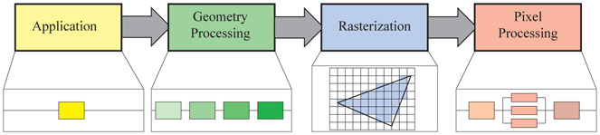
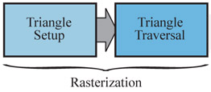

# 渲染工作流程  
  
  
****现代游戏开发本质上是计算机科学各个前沿方向——图形学、AI、物理模拟、系统架构等技术——的高度集成与应用.
就渲染流程而言,《Real-Time Rendering fourth edition》里头是Application -> Geometry Processing  -> Rasterization -> Pixel Processing ****  
这几个过程在不同角度的划分其实不同,但流程确实是这几个.应用阶段->几何处理->光栅化->像素处理(也叫片元处理fragment processing)  
  
**CPU（Application 阶段）**  
* 解析/加载/合成高层游戏数据  
* 构建命令列表  
* 执行游戏逻辑和剔除  
**GPU（Geometry Processing 及后续阶段）**  
* 真正的顶点着色、图元装配、光栅化、像素着色  
* 也可以利用 Compute Shader 做辅助计算（法线生成、实例数据展开、粒子模拟等），但这部分通常要先通过命令缓冲告诉 GPU：执行哪条 Compute Pass，再把结果写入 Buffer，再回到 Application 阶段或直接进入下游渲染阶段。  
  
  
(1)传统的模型在计算机里头都是由大量的点形成的三角片组成的mesh(网格)  
  
起点:游戏一些静态数据(3d模型,光源,材质贴图等) 和 游戏内逻辑  
			       | |  
			       | |     
			      \   /  
			       V  
Application:非交互数据直接处理打包,会交互的数据则在交互计算好后再打包.
			       | |  
			       | |    通过cpu将数据统一递给gpu, 进入gpu首个过程Geometry processing  
			       | |	进阶: 统一架构不需要cpu传递,直接gpu在内存中用就好,因为cpu和gpu共用内存.而传统架构需要cpu再传递  
			      \   /  
			       V  
Geometry Processing:GPU处理每一个顶点和三角形(1)的主战场,输出裁剪空间位置及插值变量（如法线、UV、世界坐标等）。  
			       | |  
			       | |     
			      \   /  
			       V  
Rasterization:将三角形图元（Primitive）转化为 **屏幕上的像素候选区域（Fragment片源）**。  
			       | |  
			       | |     
			      \   /  
			       V  
Pixel Processing:为每个有效的 fragment（像素候选）计算其最终颜色值（和其他附加值，如法线、粗糙度等）。  
			       | |  
			       | |     
			      \   /  
			       V  
终点:屏幕像素的具体颜色值  
  
—————————————————————————————————————————————————————————————————————————————  
## 	· Application**** 无子阶段****  
		由于该阶段为cpu执行,开发者可以全权控制.实际上对应于代码阶段把各种模型,贴图,光源等actor实体(或者叫做gameObject)和游戏内各种逻辑事件如碰撞检测后生成的数据打包成缓冲(buffer)的过程(接下来数据提交给GPU处理). Application也同样对对应于游戏引擎unreal engine5的UAsset 资源加载(模型、材质、纹理从 .uasset 中加载并解析)等.  
		即:游戏的逻辑,各种数据的计算,和数据的生成的结果一一被打包成buffer(缓冲)交给GPU来画出来  
		  
		进阶:由于倒入模型,光源等等数据都是cpu解析各自数据包后生成自己所需的数据(如法线,切线等),这些过程实际就是用cpu计算处理数据打包数据,目的是打包数据,如果有些数据数据量很大,也可以通过GPU的comput shader来算出来再通过cpu打包.  
  
  
  
## 	·Geometry Processing  
**		几何处理阶段可子划分:**  
					Vertex Shader                  ︱ Model→(Model Matrix)->World→(View Matrix)->View→(Perspective Matrix)->Clip（输出 varying差值变量 和 control points补丁控制点）  
						   ↓  
					[ Hull Shader ]                  ︱ 可选，决定细分级别(输出控制点 和 Tessellation factors曲面细分因子)												   ↓  
					  Tessellator                      ︱ 固定功能，细分patch(补丁), 生成子顶点参数坐标 (u,v 或 重心坐标)  
						   ↓  
					[ Domain Shader ]           ︱ 可选，对细分后顶点执行变换,  计算出子顶点的最终位置和属性  
						   ↓  
					[ Geometry Shader ]       ︱ 可选，对图元做二次生成／剔除  
						   ↓  
					[ Stream Output ]            ︱ 可选，把顶点数据写回缓冲  
						   ↓  
					Primitive Assembly          ︱ 按索引组装图元 + 背面剔除  
						   ↓  
					Clipping                            ︱ 裁剪空间剔除 & 重构  
						   ↓  
					Perspective Division        ︱ 裁剪→NDC  
						   ↓  
					Viewport Transform         ︱ NDC→屏幕坐标  
						   ↓						Rasterization   
  
  
  
### 		·Vertex Shading  
			职责:“对每个顶点执行MVP变换和其自身组件属性的计算（法线、UV、世界坐标、顶点颜色等）.“ .  
	  		**传统用途**：在vertex(顶点)层面进行简单光照计算（例如漫反射、镜面反射所需的光照向量、折射/反射角度），并把结果存为顶点颜色。也应此被叫做vertex Shading  
	  		**现代扩展**：  
                * 蒙皮（skinning）与形状插值（morph targets）  
                * 硬件实例化（instancing）  
                * 任意自定义计算（法线扰动、顶点级粒子模拟、预计算阴影等）  
			  
			在unreal engine5里头等价于“每个 MeshPass（深度或 BasePass）里，由相应的 Vertex Factory 绑定数据，再由材质顶点着色器在 GPU上完成这些变换和属性计算。”的过程  
  
  
### 		**· Hull Shader**  
			职责:决定 Tessellation Factors(细分级别)  
  
### 		**· Tessellator **  
			职责:根据细分级别细分补丁，生成子顶点参数 (u,v) 或重心坐标  
  
### 		**· Domain Shader**  
			职责:对生成的子顶点执行变换和属性计算，输出裁剪空间坐标和插值变量  
  
### 		**· Geometry Shader**  
			职责:可生成或剔除图元，用于点扩展 (Sprite)、阴影体积、曲面细分后处理等  
			**UE5**对应：较少使用，材质 Domain 设置中可选 Geometry Shader  
  
### 		**· Stream Output**  
			职责:可将vertex输出到一个array(数组)中进一步处理 和 用于粒子系统更新、GPU 驱动动画、后续绘制准备等  
			**UE5 等价**在 F*PassMeshProcessor::AddMeshBatch() 中，封装 Draw Call 时自动处理剔除与图元装配  
  
  
### 		**· Primitive Assembly**  
			职责:按索引（Index Buffer）将顶点组装为图元（三角形/线/点）和 背面剔除（Back‑face Culling）:丢弃摄像机背向的三角形,减少后续负担  
			**UE5 等价**Niagara 粒子系统和 GPU 驱动动画管线  
  
  
		·Projection  
			职责:“对每个顶点执行MVP投影变换进入裁剪空间.“ .  
  
		·Clipping  
			职责:“将摄像机视锥体意外的部分去除掉,节省渲染资源“ .  
  
		·Screen Mapping  
			职责:“对每个顶点执行透视除法将裁减空间变换进入标准化设备坐标空间NDC, 再将NDC坐标(3d)映射为实际屏幕坐标(2d)“ .  
			在unreal engine5里头等价于GPU Rasterizer 阶段自动完成透视除法与视口变换  
  
  
  
  
  
—————————————————————————————————————————————————————————————————————————————  
  
## 	·Rasterization(也叫Scan Conversion扫描转换)  
**		光栅化可子划分:Triangle Setup(也叫Primitive Assembly) 和 Triangle Traversal(三角形遍历)**  
**		就是处理geometry processing输出的点,线,三角面数据,但由于triangle(三角面)太多,子阶段也成了triangle开头的名字了.**  
  
  
  
		  
### **		·Triangle Setup（📌有歧义）**  
			职责:  
			•	负责构建三角形的边方程、插值因子、视差校正信息等；  
			•	有些资料将此阶段归为 Geometry Processing（作为 Projection 后的后处理）；  
			•	《Real-Time Rendering》将其叫做 Primitive Assembly，放在 Rasterization 前。  
  
### 		·Triangle  Traversal  
			职责:  
			•	遍历屏幕上的像素；  
			•	判断哪些像素被当前三角形覆盖（Coverage Test）；  
			•	并在被覆盖像素中插值出深度、颜色、法线等；  
			•	生成 Fragment（片段）供 Fragment Shader 处理。  
  
—————————————————————————————————————————————————————————————————————————————  
  
## 	· Pixel Shading**** ****  
**		像素着色阶段可子划分:Pixel Shading 和 Merging 两个子阶段**  
		  
  
  
### **		·Pixel Shader（也叫Fragment Shader）**  
			职责:****为每个 fragment（候选像素）计算最终颜色或其他输出值,****是“美术视觉效果”的主要来源  
			**UE5 对应：**  
			•	Pixel Shader 是材质系统生成的 shader graph 的核心输出。  
			•	渲染管线配置（如 Render Graph）决定了用哪个材质、写入哪个 Buffer。  
  
### 		·Merging (也叫Output Merger / Per-fragment Operations)  
			职责:**为每个 fragment 做测试、混合、决定写入帧缓冲的最终颜色值。**  
